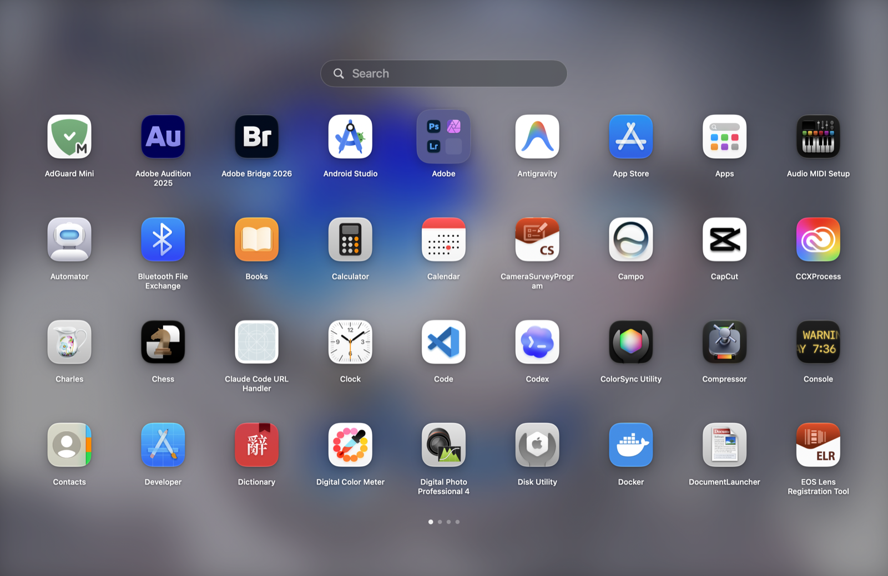

# Glyphpad

[English README](README.md)

Apple 让 Launchpad 消失了。Glyphpad 想用开源的方式把它带回来。

一个原生、快速的现代 macOS Launchpad 替代品：打开，输入几个字母，启动应用，然后继续做你的事。仅 **3 MB**。

Glyphpad 保留经典的全屏网格、搜索、文件夹、分页和拖拽排序，再补上 Launchpad 本来就该有的能力：自定义布局、自定义背景、全局快捷键和独立设置窗口。重要数据都留在本机 SQLite。后续的大模型辅助整理会是帮手，不会替你接管本机数据。

## 截图



## 为什么用它

- **Launchpad 回来了**：Apple 移除它之后，Glyphpad 把全屏应用网格这件事重新做回来。
- **仅约 3 MB**：小到像系统自带工具，而不是又一个平台。
- **原生、快速**：它是 macOS app，不是披着外壳的网页。
- **搜索优先**：打开就能直接打字，搜索框已经准备好。
- **文件夹和排序会保存**：拖拽排序、创建文件夹、拖入拖出，布局都会记住。
- **不留空文件夹**：文件夹空了就自动清理。
- **经典或紧凑都行**：想要 Launchpad 节奏就横向分页，应用很多就纵向滚动。
- **外观自己定**：行数、列数、图标大小、背景图片、虚化强度和自动排列都能调。
- **全局快捷键**：一键呼出，也可以换成你自己的快捷键。
- **默认本地优先**：应用元数据、布局、文件夹、设置和后续分类历史都存在本机 SQLite。
- **为智能整理预留接口**：OpenAI 兼容 API 配置已经准备好，后续可以接自动分类流程。

## 环境要求

- 安装 Xcode 的 macOS。
- Swift 6 工具链。
- 系统 SQLite 库。

当前 Swift Package 的构建平台基线是 `.macOS(.v15)`；产品目标是作为 macOS 26+ 的 Launchpad 替代品。

## 构建方式

使用 Swift Package Manager 构建和测试：

```sh
swift build
swift test
```

使用 Xcode 命令行构建 app scheme：

```sh
xcodebuild -scheme GlyphpadApp -destination 'platform=macOS' build
```

生成本地 macOS app bundle：

```sh
bash scripts/build-app-bundle.sh
```

生成结果位于：

```text
dist/Glyphpad.app
```

## 使用方式

打开生成的 app：

```sh
open dist/Glyphpad.app
```

Glyphpad 以辅助应用形式运行，启动器打开时不会常驻显示 Dock 图标。

基本使用流程：

1. 打开 Glyphpad，全屏启动器出现。
2. 直接输入搜索，点一下应用就启动。
3. 用完按 `Escape`，或者点击空白处关闭。
4. 拖拽应用调整顺序。
5. 把一个应用拖到另一个应用上，就能创建文件夹。
6. 应用可以拖进文件夹，也可以再拖回顶层。
7. 使用 `Command + ,` 打开设置窗口，调整布局、分页、背景、API 和全局快捷键。

## 快捷键

| 快捷键 | 功能 |
| --- | --- |
| `Option + Space` | 默认全局快捷键，用于显示或隐藏 Glyphpad，可在设置中修改。 |
| `Command + ,` | Glyphpad 激活时打开设置窗口。 |
| `Escape` | 关闭启动器。 |
| `Left Arrow` | 横向分页模式下切换到上一页。 |
| `Right Arrow` | 横向分页模式下切换到下一页。 |
| `Command + Q` | 退出 Glyphpad。 |

## 设置窗口

Glyphpad 不把启动器塞满按钮。所有配置都放在独立设置窗口里：

- **Layout**：自动排列、列数、行数、图标大小、纵向滚动和横向分页。
- **Keyboard**：录制自定义全局快捷键，并可恢复默认快捷键。
- **Appearance**：选择背景图片、清除背景图片、调整虚化强度。
- **API**：本地保存 OpenAI 兼容 endpoint 和 API key，为后续分类能力提供配置基础。

## 本地数据

运行时数据保存在本机：

```text
~/Library/Application Support/Glyphpad/Glyphpad.sqlite
```

SQLite 数据库包含应用元数据、文件夹、文件夹成员、启动器布局顺序、启动器设置、分类和分类建议相关表。

## 开发流程

项目协作流程记录在 [AGENTS.md](AGENTS.md)。有明确范围的迭代会记录在 `spaces/YYYY-MM-DD-short-requirement-name/` 下，包括背景、TODO、决策和验收标准。

常用开发命令：

```sh
swift build
swift test
xcodebuild -scheme GlyphpadApp -destination 'platform=macOS' build
```
